# Modbus项目方案书

根据规格书的要求，制定Modbus项目的方案书，针对不同的功能和需求，进行实际开发过程的方案设计，确定功能实现的具体方式，以流程图的形式描述其实现方法，并以此为基础最终实现主站与从站的相关模块，完成整个Modbus项目的实际开发流程。

## 一、Modbus TCP 主站

### 1. Modbus TCP主站 客户端软件初始化过程

主站客户端初始化过程，在加载完UI的控件后，需要构建专门用于TCP网络通信的对象，以及专门用于处理相关报文的对象。

随后需要在初始化过程中，将部分信号与其需要触发的槽函数进行绑定，包括：

* 选择不同功能码时触发槽函数
* 当用户修改了线圈数据表中的内容时触发槽函数
* 当用户修改了寄存器数据表中的内容时触发槽函数
* 按下连接按钮时触发槽函数
* TCP网络成功建立连接后触发槽函数
* TCP网络因故断开连接时触发槽函数
* TCP网络接收到消息报文时触发槽函数
* 按下发送按钮时触发槽函数

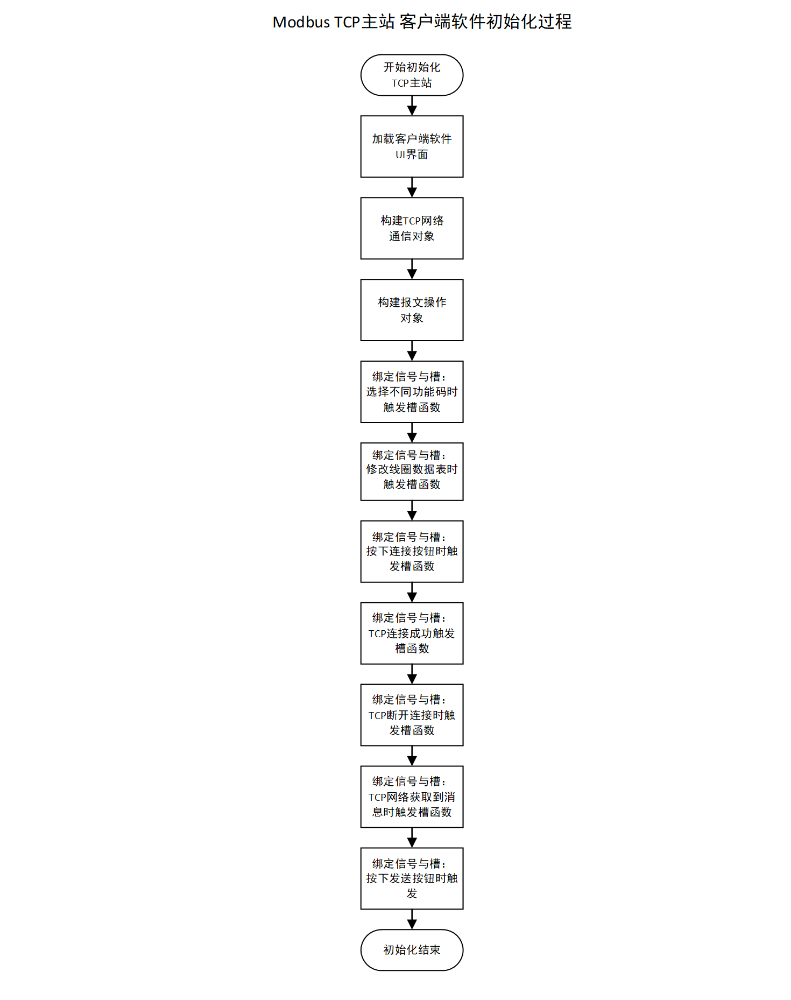

### 2. 选择不同的功能码时改变控件的输入状态和提示信息

```c++
void Widget::FunUpdateStatusForControl(int cbbxIndex)
```

参数cbbxIndex为当前用户所选择的功能码所在的序号：

* 0 对应 0x01
* 1 对应 0x03
* 2 对应 0x0F
* 3 对应0x10

根据用户选择的不同的功能码时，清空此前数据框中起始地址和数量项的数据，并改变输入框提示信息和限定不同的输入范围。

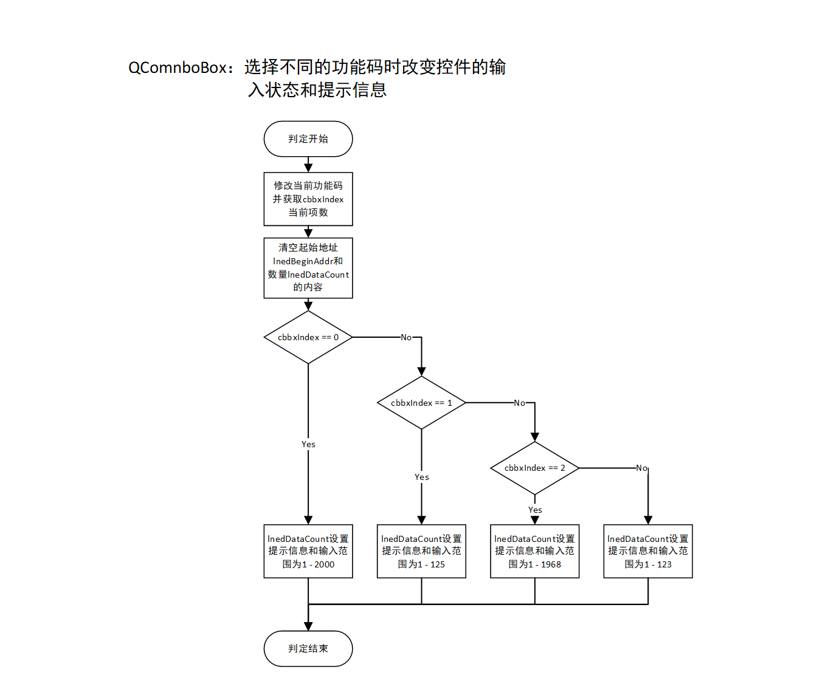

### 3. 数据表中的内容被修改后进行数据检测

```c++
void Widget::FunCheckInputCoilData(int row,int col)
```

```c++
void Widget::FunCheckInputRegistData(int row, int col)
```

由cellChanged触发的槽函数，参数row和col为数据表中被修改的单元格的行号与列标，触发槽函数后，检测用户输入的数据是否符合要求，合法则输入数据表中更新显示，不合法则按照规则将其修改为合法的数据。

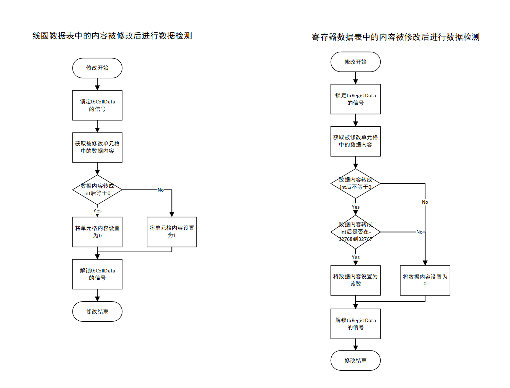

### 4. 连接按钮槽函数，点击后进行网络连接，再次点击断开连接

```c++
void Widget::FunBtnConnect(void)
```

当用户按下按钮后触发的槽函数，根据当前TCP网络的实际连接情况，判定需要完成的连接操作。按钮带有翻转状态，连接状态下点击为断开连接，非连接状态下点击为开始连接，结合其他函数功能实现TCP网络连接的控制。

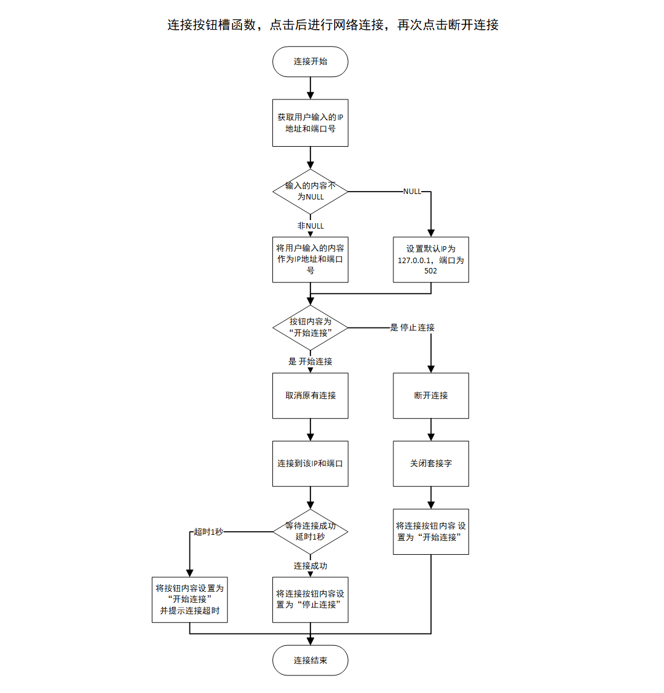

### 5. 按下发送按钮，对要发送的数据做封装处理

```c++
void Widget::FunSendMess(void)
```

按下发送按钮时所触发的槽函数，获取当前请求报文的序号自增、协议标识、计算其后字节数、请求的从站编号、功能码、起始地址、数量项，以及数据项，通过一定规则封装成一个完整的请求报文，根据功能码的不同，封装的方式和需要的数据也不同。

完成报文的封装后，利用socket套接字的write()方法，通过TCP将报文发送出去。

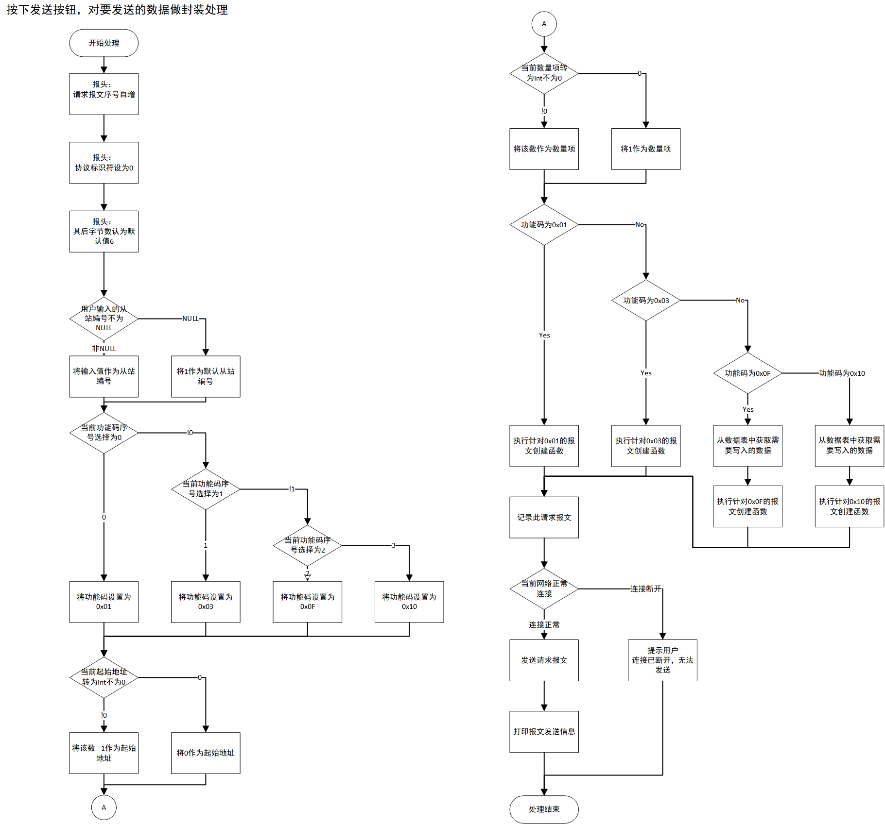

### 6. 生成请求报文

```c++
QByteArray ClaMessageBuild::Fun0x010x03MessageCreate(   quint16 messNo,
                                                        quint16 protocol,
                                                        quint16 byteCount,
                                                        quint8 viceNo,
                                                        quint8 funcCode,
                                                        quint16 beginAddr,
                                                        quint16 dataCount)
```

* messNo：请求报文序号（调用前自增）
* protocol：协议标识（0x0000标识代表Modbus协议）
* byteCount：其后字节数
* viceNo：从站编号
* funcCode：功能码
* beginAddr：起始地址
* quint16：数量

读取线圈和读取寄存器的请求报文格式相对统一，读取时没有数据项，按照顺序将上述数据封装在一个QByteArray中，最后返回。

```c++
QByteArray ClaMessageBuild::Fun0x0FMessageCreate(   quint16 messNo,
                                                    quint16 protocol,
                                                    quint16 byteCount,
                                                    quint8 viceNo,
                                                    quint8 funcCode,
                                                    quint16 beginAddr,
                                                    quint16 dataCount,
                                                    quint8 dataByteCount,
                                                    QString dataStr)
```

* messNo：请求报文序号（调用前自增）
* protocol：协议标识（0x0000标识代表Modbus协议）
* byteCount：其后字节数
* viceNo：从站编号
* funcCode：功能码
* beginAddr：起始地址
* quint16：数量
* dataByteCount：数据项的总字节数
* dataStr：要写入的线圈或寄存器的数据项

写入线圈或寄存器数据时，需要带有要写入的数据项，以及写入数据的总字节数，按照顺序封装在一个QByteArray中，最后返回。

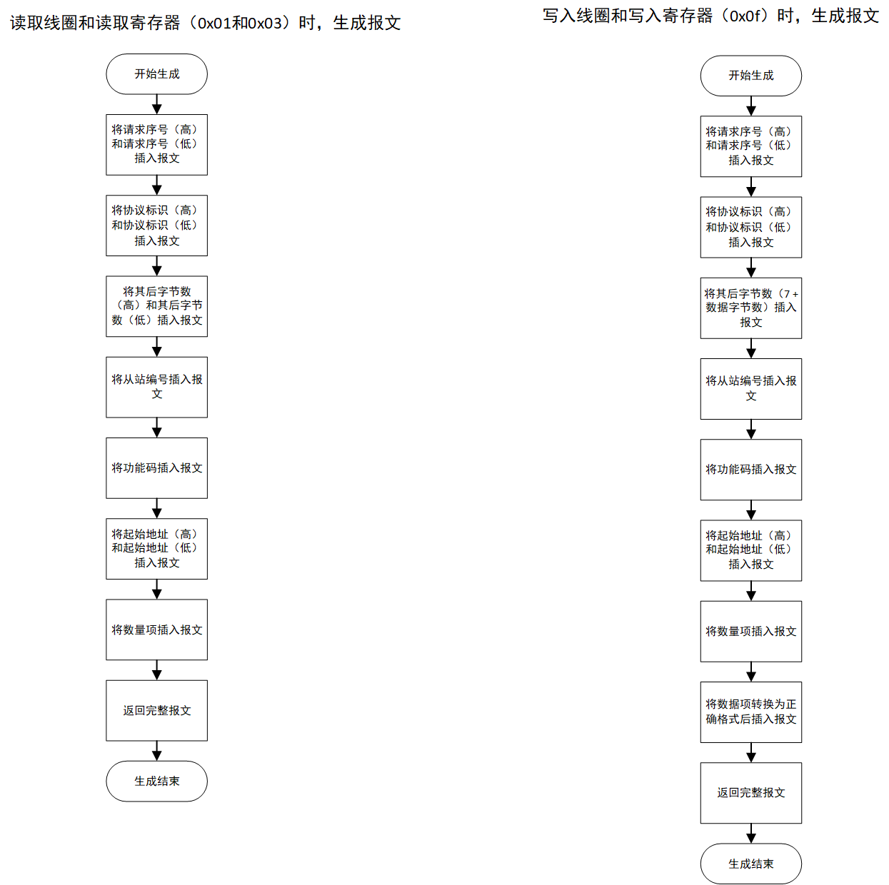

### 7. 解析获取到的报文消息

```c++
void ClaMessageBuild::FunAnalyseMessData(QTextEdit *txtShowMess,
                                         QTableWidget *tbCoilData,
                                         QTableWidget *tbRegistData,
                                         QByteArray LastCmd,
                                         QByteArray array)
```

* txtShowMess：用于显示提示消息的控件
* tbCoilData：用于显示线圈数据的数据表
* tbRegistData：用于显示寄存器数据的数据表
* LastCmd：被记录的上一条请求报文
* array：接收到的响应报文

根据被记录的上一条请求报文，与接收到的响应报文做对应，首先对响应报文做合法性判定，判定合法后将请求报文的合理响应与当前的响应报文做比较，若是一致则表示该响应正确，不一致则不正确。

响应正确时，根据读写数据的不同，读取数据时响应报文存在返回的数据项，将获取到的数据进行解析，并存放于tbCoilData或tbRegistData数据表中。

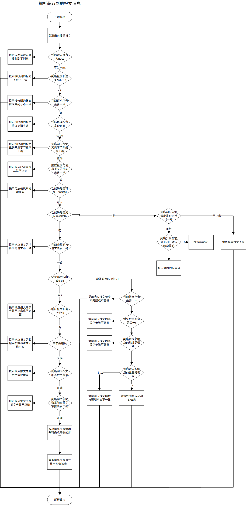

## 二、Modbus RTU 从站

### 1. Modbus RTU从站 客户端软件初始化过程

从站客户端的加载过程，在加载完需要的控件，以及读取ini文件中所有存储的线圈于寄存器数据后，需要构建专门用于串口连接的对象，同时获取当前所有可用的串口并显示，其次需要构建专门用于处理报文的对象，随后就是相关信号与槽函数的绑定：

* 从新设置从站编号，按下按钮时触发槽函数
* 修改线圈数据表中的数据并存储在ini文件中触发槽函数
* 修改寄存器数据表中的数据并存储在ini文件中触发槽函数
* 打开或关闭串口，按下按钮时触发槽函数
* 当接收到来自串口的消息时触发槽函数

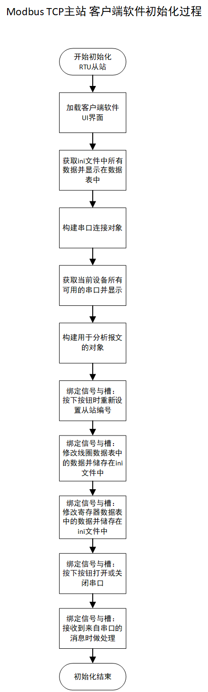

### 2. 读取ini文件所有线圈、寄存器数据并显示

```c++
void Widget::FunGetIniAllData(void)
```

构建对象打开指定的ini文件，通过循环将所有的数据读取并显示在线圈、寄存器数据表中对应位置的单元格中。

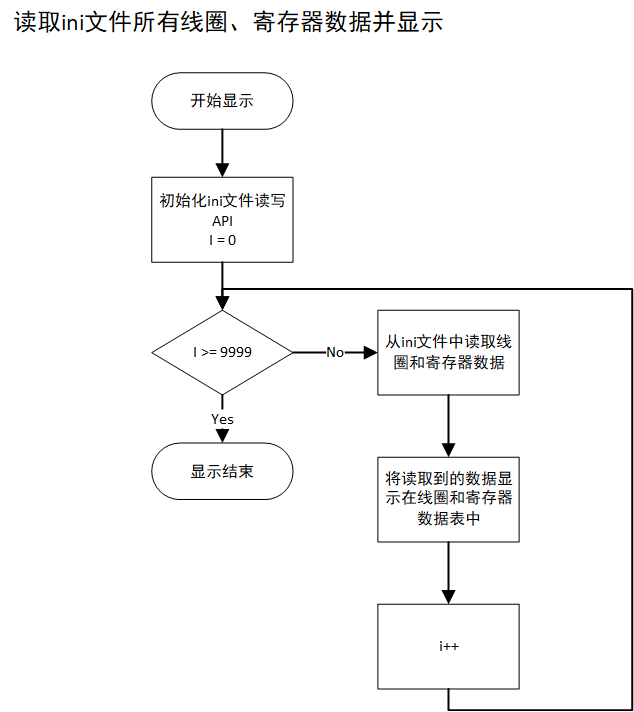

### 3. 重新设置从站编号，并显示当前编号

```c++
void Widget::FunSetViceNo(void)
```

由用户自行输入新的从站编号，点击按钮后将本机的从站编号重新设置，输入范围被限定在1 - 247之间，若输入0或NULL，则默认设置为1。

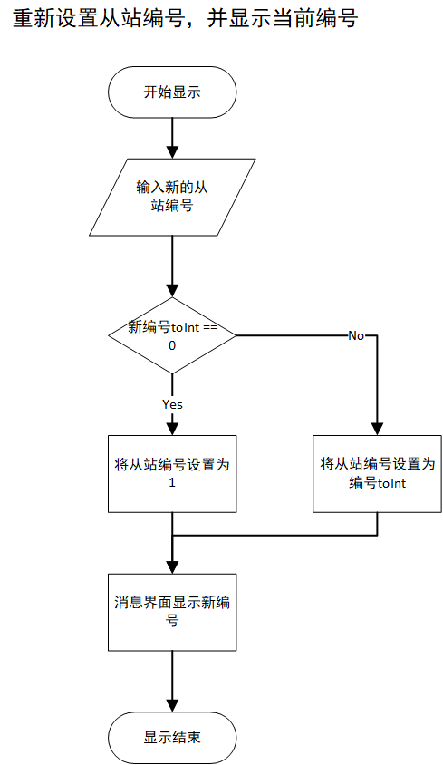

### 4. 数据表中的内容被修改后进行数据检测 

```c++
void Widget::FunRenewDataForCoil(int row, int col)
```

```c++
void Widget::FunRenewDataForRegist(int row, int col)
```

由cellChanged触发的槽函数，参数row和col为数据表中被修改的单元格的行号与列标，触发槽函数后，检测用户输入的数据是否符合要求，合法则输入数据表中更新显示，不合法则按照规则将其修改为合法的数据。

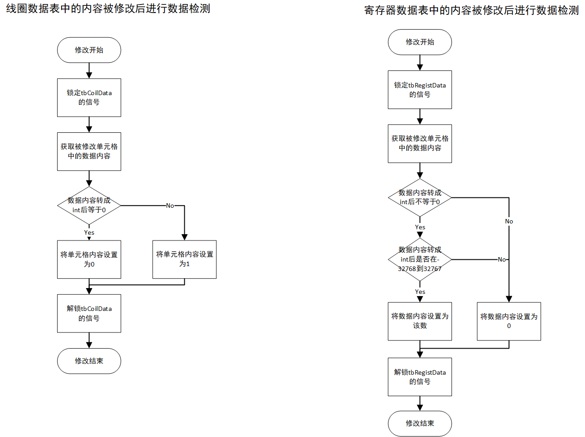

### 5. 打开或关闭串口，按下按钮时触发的槽函数

```c++
void Widget::FunGetSerialValueAndConnect(void)
```

按下按钮时触发的槽函数，获取当前用户设置的串口号、波特率、数据位、校验位、停止位数据，尝试进行串口的打开，打开后会出现打开成功和打开失败两种状态，根据不同的状态做出不同的操作。按钮自身也带有翻转状态，再次点击状态翻转，打开串口变为关闭串口。

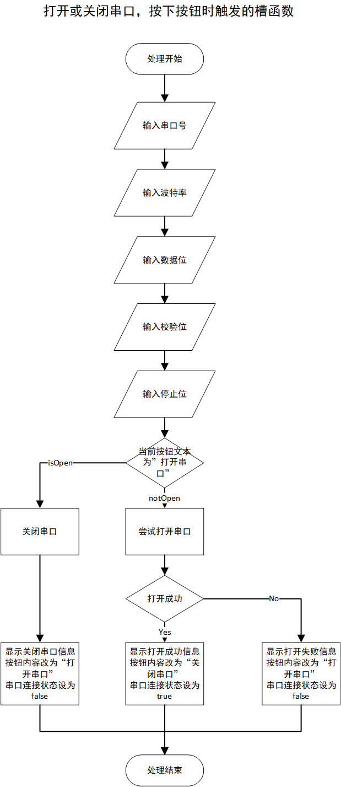

### 6. 获取从串口接收到的数据，并做解析操作

```c++
void Widget::FunGetMessageFromSerial(void)
```

当从串口获取到消息时触发的槽函数，对接收到的报文信息做解析，根据解析函数的返回码做出不同的操作：

* 解析码为0：此报文数据正确
* 解析码为-1：CRC校验不正确
* 解析码为-2：请求报文的指定从机非本机
* 解析码为1：请求报文的功能码不合法
* 解析码为3：请求报文的指定数量不正确
* 解析码为2：请求报文的起始地址错误，或起始地址 + 数量不合法

根据解析码的结果做出相对应的操作，错误时返回一个字节的报文给主站，正确时封装正确的响应报文返回给主站。

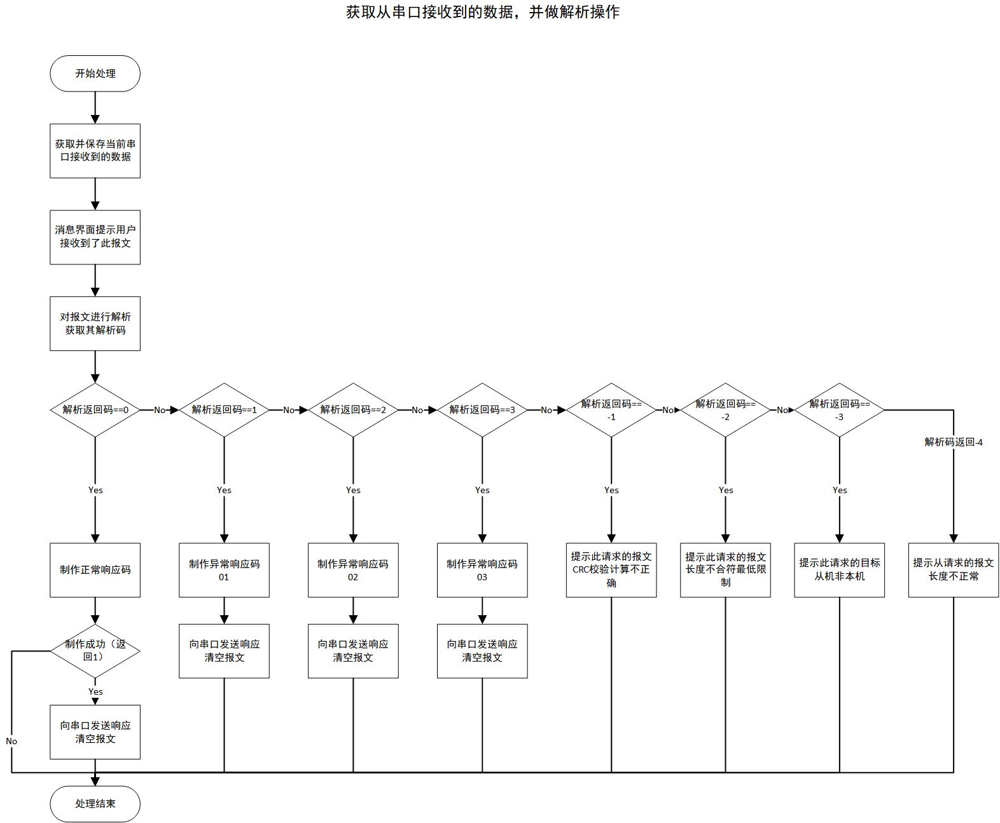

### 7. 解析报文，并返回解析码

```c++
int ClaMessageAnalyse::FunMessageAnalyse(QByteArray array, quint8 ViceNo)
```

对接收到的报文进行解析，其中的两项参数，array为接收到的报文，ViceNo为本机的从站编号。

判断接收到的报文，是否合法一个正确的请求报文格式：校验码一致、请求的从机编号与本机一致、功能码合法。

功能码合法后，针对不同的功能码做不同的操作，判断其对应的起始地址以及数量项是否合法，最终根据判定结果，对不正确的项返回其解析码。

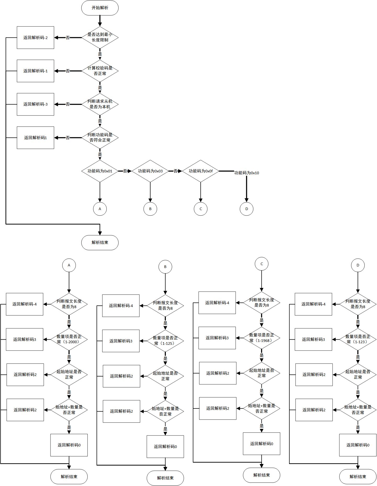

### 8.制作异常响应报文

```c++
QByteArray ClaMessageAnalyse::FunMakeUnreasonalCode(QByteArray array, quint8 errorCode)
```

当确认需要对当前请求返回异常响应时，需要制作异常相应报文。

参数列表中，array为需要对其进行响应的的请求报文，异常响应报文需要根据请求来制作；errorCode则是需要添加的异常码。

异常响应报文中的内容包括响应的从机编号，异常功能码（原功能码 + 0x80），以及根据不同情况下需要返回的异常码，最后添加CRC校验后即可完成异常响应报文的制作。

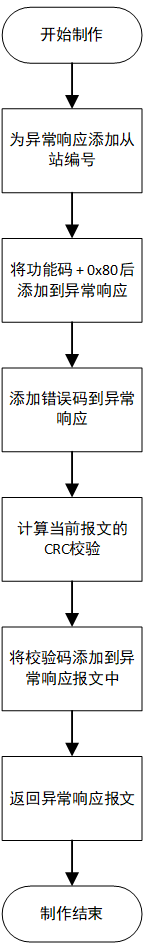

### 9.制作正常响应报文

```c++
int ClaMessageAnalyse::FunMakeReasonalCode(QByteArray array, 
                                           QByteArray *reDataToMain, 
                                           QTableWidget *tbCoilData, 
                                           QTableWidget *tbRegistData, 
                                           QTextEdit *txtShowMess)
```

制作正常响应报文同样需要请求报文做基础，参数列表中，array为请求报文，reDataToMain为返回给主站的正常响应报文，tbCoilData和tbRegistData是当功能码为写入时，需要同步刷新显示的线圈和寄存器数据表，txtShowMess则为用于向用户显示提示信息的文本消息框。

经过制作流程后，返回-1则表示因故无法完成制作，返回1则表示成功完成正常响应报文的制作，最终从站可根据其做出对应的响应操作。

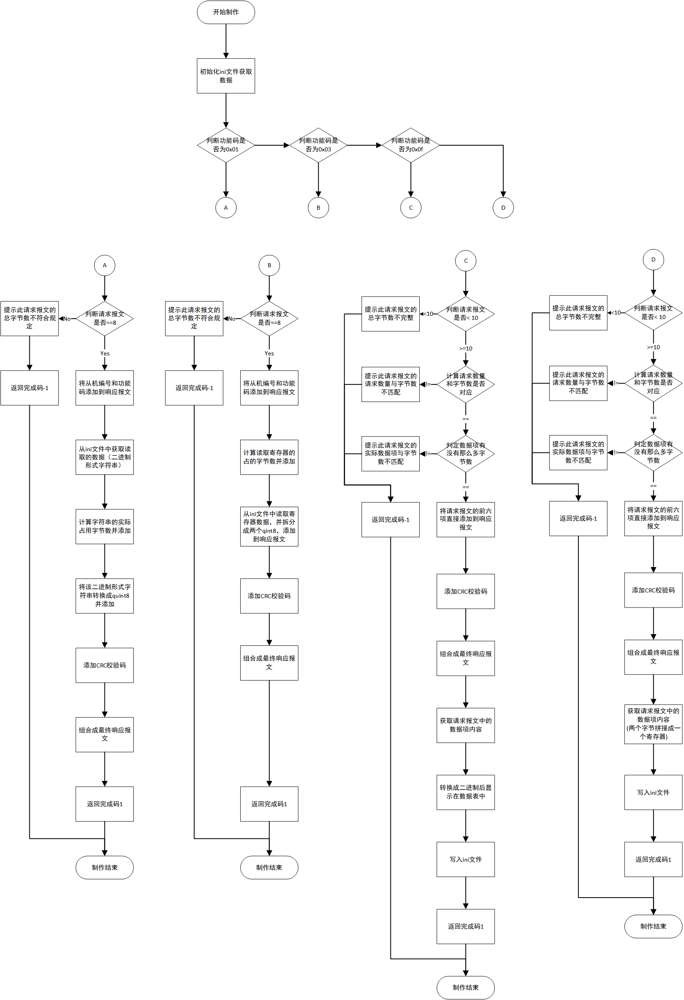